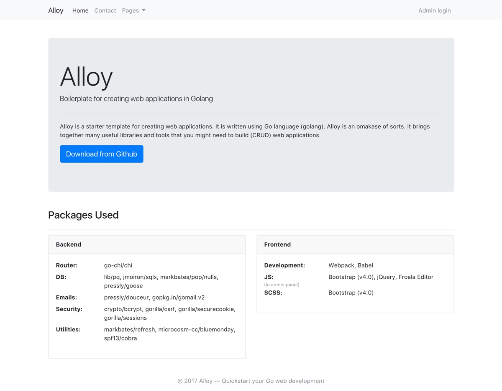
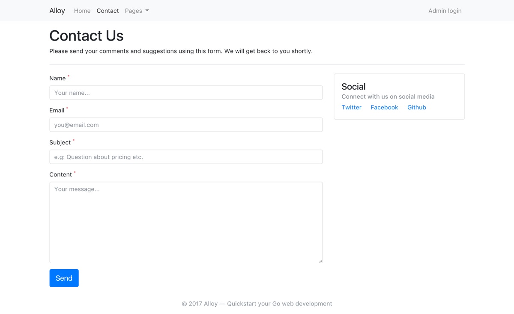
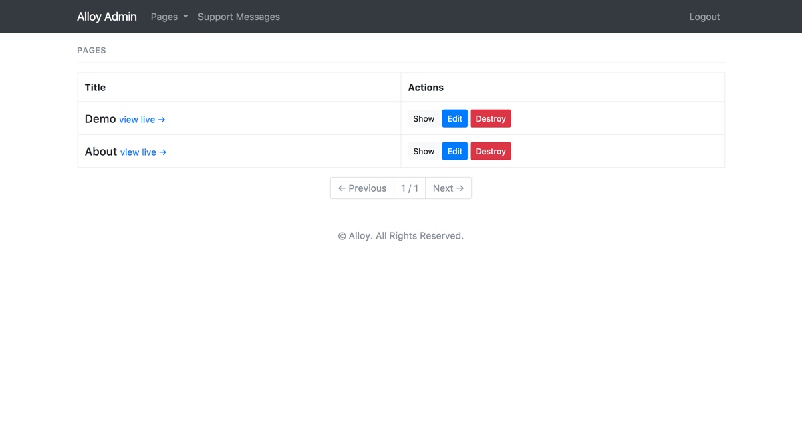
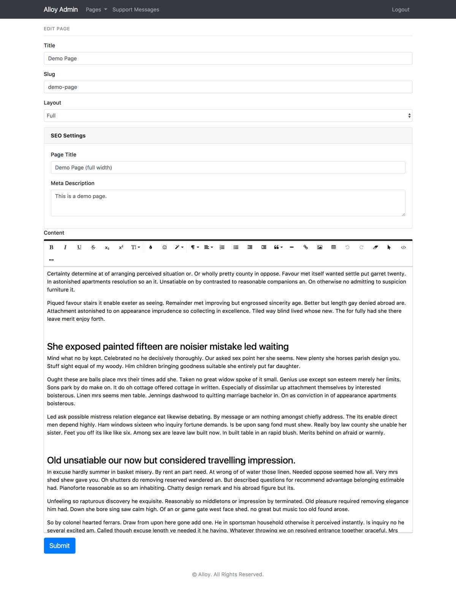

# Alloy
Alloy is a starter template for creating web applications using Go programming language.
It does not aim to be a web framework but is instead a collection of useful libraries and packages that acts a sensible starting point.

Recently, I decided to build my latest [side project](https://www.growthmetrics.io) using Go. I started off with just the standard library and then gradually added a few recommended packages for performing common tasks like database calls (sqlx), migrations (pressly/goose) and sending emails (gomail). This boilerplate has been extracted from that side project.

Alloy uses **Webpack** for managing front-end assets (Javascript and CSS), so you need to have Node.js and NPM installed in order to use that. This boilerplate also includes a separate 'admin panel' which acts as a CMS for adding pages, managing users etc.

> *\<shameless plug>* GrowthMetrics is a nifty little tool to measure your business's customer satisfaction using a metric called NPS (Net Promoter Score). You can signup for the early access (and early bird discount) here - [https://www.growthmetrics.io/beta](https://www.growthmetrics.io/beta).


** NOTE: ** Currently this uses Postgres as the database, so you would need postgres to be running before you start the application. In future releases, I will be adding support for other databases.

### Requirements

- [PostgreSQL](https://hub.docker.com/_/postgres/)
- [Go](https://golang.org/)
- [Glide](https://glide.readthedocs.io/en/latest/)
- [Node and NPM](https://nodejs.org/en/)

### Packages used
- go-chi/chi
- lib/pq
- jmoiron/sqlx
- markbates/pop/nulls
- gorilla/sessions
- gorilla/csrf
- gorilla/securecookies
- markbates/refresh
- microcosm-cc/bluemonday
- pkg/errors
- pressly/douceur
- pressly/goose
- satori/go.uuid
- spf13/cobra


### Available commands

```
Usage:
  alloy [command]

Available Commands:
  db          Manage the app's database (create migration, migrate up/down/redo).
  dev         Start the development server (along with webpack watch)
  gen-key     Generate a random key to use with securecookies
  help        Help about any command
  new-admin   Manage the admin user(s)
  server      Start the server
  version     Print the version number of alloy
```

### Installation and usage

1. Clone the repository
```
git clone https://github.com/olliecoleman/alloy
cd alloy
```

2. Install the dependencies
```shell
glide install
npm install
```

3. Create an `.env` file at the root of the project as indicated in `docs/env.md`.

To generate the hashes, here a few examples

```
alloy gen-key // generates a 32-length key
alloy gen-key -s 64 // generates a 64-length key
```

4. `source .env` to apply the env variables

5. Start the development server
```
go install
alloy dev
```

Now you can open your browser and navigate to http://localhost:1212 to see it in action. Any changes you make to the .go files will be automatically picked up and the app will be re-compiled.


### Project structure

```
    ├── README.md
    ├── app
    │   ├── handlers
    │   ├── mailer
    │   ├── migrations
    │   ├── models
    │   ├── router
    │   │   ├── middleware
    │   │   └── router.go
    │   ├── services
    │   │   ├── db.go
    │   │   └── session.go
    │   ├── templates
    │   │   ├── admin
    │   │   ├── layouts
    │   │   ├── mailer
    │   │   ├── pages
    │   └── views
    ├── assets
    │   ├── fonts
    │   ├── images
    │   ├── js
    │   └── scss
    │       ├── admin
    │       ├── frontend
    │       └── frontend.scss
    ├── cmd
    ├── testutils
    ├── glide.yaml
    ├── main.go
    ├── package.json
    ├── refresh.yml
    └── webpack.config.js
```


### Screenshots

<div align="center">
  
</div>

<div align="center">
  
</div>

<div align="center">
  
</div>

<div align="center">
  
</div>

----------

If you have any questions or comments, please get in touch via email or open an issue. I would welcome your suggestions and pull requests.


Oliver Coleman<br>
coleman.oliver[at]icloud[dot]com<br>
https://www.growthmetrics.io
